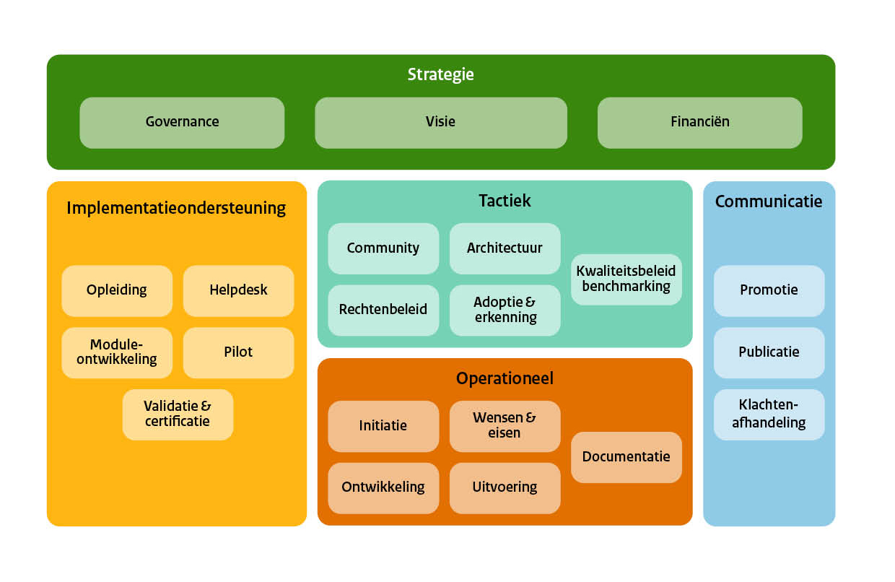

# Inleiding {#43941D42}
## Introductie  {#24334864}
Onder de Omgevingswet worden gegevens over externe veiligheidsrisico’s via het Register Externe Veiligheidsrisico's verzameld, beheerd en beschikbaar gesteld. In dit register staan bijvoorbeeld alle bedrijven die brandbare, explosieve, giftige en nucleaire stoffen verwerken of opslaan en transportroutes en buisleidingen voor gevaarlijke stoffen. 
 
 
Voor de meeste <a href='https://iplo.nl/regelgeving/regels-voor-activiteiten/toelichting-milieubelastende-activiteiten/' target='_blank'>milieubelastende activiteiten</a> met veiligheidsrisico's is de provincie of de gemeente het bevoegd gezag. Het Ministerie van Economische Zaken en Klimaat verzamelt de gegevens voor het aanleggen en exploiteren van een mijnbouwwerk. Het Ministerie van Infrastructuur en Waterstaat verzamelt de gegevens voor buisleidingen. Net als de gegevens voor het <a href='https://www.infomil.nl/onderwerpen/veiligheid/basisnet/' target='_blank'>basisnet</a>. Voor vervoer van gevaarlijke stoffen over andere openbare wegen en vaarwegen, verzamelt de beheerder van die (vaar)wegen de gegevens. Afhankelijk van de (vaar)weg is dit de gemeente, de provincie of het waterschap.
 
 
Om deze gegevens allemaal op dezelfde manier beschikbaar te kunnen stellen via het Register Externe Veiligheidsrisico's (REV), is er het Informatiemodel Externe Veiligheid. Dit informatiemodel beschrijft de structuur waarin gegevens moeten worden vastgelegd zodat de gegevens zowel door een machine als een mens te verwerken zijn. Daarbij is er veel aandacht voor de betekenis – de semantiek - van gegevens. Er zijn immers verschillende aanleverende partijen betrokken en veel verschillende afnemers van de data die in het REV is opgeslagen. Voor ieder van hen moet de betekenis van gegevens eenduidig zijn. Daarom is het informatiemodel uitgerust met een gegevenswoordenboek. Hierin zijn de gehanteerde begrippen zo eenduidig mogelijk vastgelegd.
In het <a href='https://docs.geostandaarden.nl/imev/imev/' target='_blank'>informatiemodel externe veiligheid</a> staat:
<ul><li>welke gegevens opgenomen worden in het REV;</li>
<li>wat die gegevens precies betekenen;</li>
<li>de structuur van de gegevens in de vorm van objecten, attributen en relaties;</li>
<li>of een gegeven verplicht is of niet;</li>
<li>welke overige afspraken kunnen worden vastgelegd over de gegevens;</li>
<li>en hoe deze gegevens in het register moeten worden vastgelegd.</li>
</ul>
 
 
De nadruk van het informatiemodel ligt op het beschrijven van de gegevens die noodzakelijk zijn om de plaatsgebonden risicocontouren en aandachtsgebieden uit te wisselen die horen bij operationeel uitgevoerde externe veiligheidsactiviteiten. 
<i>Welke</i> gegevens bevoegde gezagen ten aanzien van de externe veiligheid moeten verzamelen, staat  beschreven in artikel 11.2 tot en met 11.7 van het <a href='https://wetten.overheid.nl/BWBR0041313' target='_blank'>Besluit kwaliteit leefomgeving</a> (Bkl). In bijlage VII-X van het Bkl  zijn de kenmerken over opslag, productie, gebruik en vervoer van gevaarlijke stoffen en windturbines de milieubelastende activiteiten met vastgestelde afstanden opgenomen. Het informatiemodel beschrijft <i>hoe</i> deze gegevens in het register moeten worden vastgelegd. Het informatiemodel externe veiligheid is daarmee de basis voor software waarmee de bevoegde gezagen hun gegevens aan het register aanleveren. Het <a href='https://www.geonovum.nl/geo-standaarden/informatiemodel-externe-veiligheid' target='_blank'>informatiemodel externe veiligheid</a><u> </u>wordt in opdracht van het Ministerie van Infrastructuur en Waterstaat beheerd door <a href='https://www.geonovum.nl/over-geonovum/wie-wij-zijn' target='_blank'>Geonovum</a>. Met dit beheerplan geven inzicht wat het beheer is en hoe wij dat uitvoeren. 
 
 
De data uit het <a href='https://www.registerexterneveiligheid.nl/' target='_blank'>Register Externe Veiligheidsrisico's</a> is te bekijken via de <a href='https://www.atlasleefomgeving.nl/thema/veiligheid' target='_blank'>Atlas Leefomgeving</a>. Burgers en bedrijven kunnen zo een beeld krijgen van de risico's in hun leefomgeving. Het REV is ook van belang voor het <a href='https://iplo.nl/thema/externe-veiligheid/register-externe-veiligheidsrisico/' target='_blank'>bevoegd gezag</a>. Via het REV kunnen verschillende overheden de door hen ingewonnen gegevens over externe veiligheidsrisico’s gemakkelijk delen. De overheid heeft deze gegevens nodig voor de oordeelsvorming bij het nemen van besluiten over omgevingsvergunningen en voor omgevingsplannen. 
Het REV is een landelijk register en vervangt sinds 1 januari 2023 het <a href='https://www.infomil.nl/onderwerpen/veiligheid/register-en/' target='_blank'>register risicosituaties gevaarlijke stoffen</a> (RRGS). Het REV is de basis voor alle data rond externe veiligheidsrisico’s. Het beheer van dit register valt onder de verantwoordelijkheid van het Ministerie van Infrastructuur en Waterstaat (artikel 11.8 van het <a href='https://iplo.nl/thema/externe-veiligheid/register-externe-veiligheidsrisico' target='_blank'>Besluit kwaliteit leefomgeving</a> (Bkl)). Het beheer van het REV wordt uitgevoerd door Rijkswaterstaat (WVL). 
## Ontwikkelen en beheren van standaarden  {#34787AAB}
Sinds 2021 beheert Geonovum het Informatiemodel Externe Veiligheid (IMEV). Wij doen dat in opdracht van het Ministerie van Infrastructuur en Waterstaat (IenW). Geonovum beheert ook de standaarden voor de aanpalende thema’s in de Omgevingswet, zoals Informatiemodel Geluid in opdracht van RIVM en de Toepassingsprofielen voor Omgevingsdocumenten (TPOD) in opdracht van het Ministerie voor Volkshuisvesting en Ruimtelijke Ordening (VRO). Daarnaast is Geonovum betrokken bij de aansluiting van informatiebronnen (zoals het REV) op het Digitaal Stelsel Omgevingswet (DSO-LV). Tevens werken wij in opdracht van het Ministerie van Infrastructuur en Waterstaat aan de standaarden voor het Digitaal Stelsel VTH. In het kader van de <a href='https://www.geonovum.nl/themas/europese-datastrategie' target='_blank'>Europese datastrategie</a> zijn wij betrokken bij de ontwikkeling van dataspaces, met name die voor de Green Deal.
 
 
De maatschappij beter laten presteren met geo-informatie. Dat is waar wij bij Geonovum dagelijks aan werken. Onze ambitie is een geodata infrastructuur waarop je letterlijk en figuurlijk kunt bouwen. Of je nu geo-specialist bent, beleidsregels maakt, een vergunning aanvraagt of apps bouwt. Wij doen dit door ontwikkelingen rond geo-informatie te verkennen, door partijen te verbinden en door gemaakte afspraken in standaarden te verankeren. Dit doen wij in opdracht van en voor de overheid. Geonovum is een organisatie met veel kennis en een rijk netwerk. Wij opereren doelgericht, zelfstandig en pragmatisch. Onze inhoudelijke specialismen zijn de standaardisatie en architectuur van de geo-informatie infrastructuur. Onze organisatorische expertise ligt in het vermogen verschillende partijen met elkaar te verbinden en samenwerking tot stand te brengen.
De <a href='https://organisaties.overheid.nl/27912339/Stichting_Geonovum' target='_blank'>stichting Geonovum</a> is in 2007 <a href='https://www.geonovum.nl/uploads/documents/brief_VROM_oprichting_Geonovum_KST103843.pdf' target='_blank'>opgericht</a> door het ministerie van VROM. De grondslag voor Geonovums werk is vastgelegd in het <a href='https://zoek.officielebekendmakingen.nl/stcrt-2023-31981.html' target='_blank'>convenant</a> Nationale Geo-Informatie Infrastructuur tussen het ministerie van Binnenlandse Zaken en Koninkrijksrelaties en Geonovum.
 
 
Bij de ontwikkeling van standaarden volgen wij de FAIR principes: geodata moeten Findable (vindbaar) zijn, Accessible (toegankelijk), Interoperable (interoperabel) en Reusable (herbruikbaar). 
Het beheer van onze standaarden geven wij gestalte en voeren wij uit in de context van de standaarden, architectuur en voorzieningen en de gebruikers in de keten. Leidraad in bij het (door)ontwikkelen en beheren van standaarden is het ‘Beheer en Ontwikkel Model Open Standaarden’: <a href='https://www.logius.nl/diensten/bomos' target='_blank'>BOMOS</a> (zie <a href='#d4e628'>Figuur 1</a>). Geonovum past in haar werk de BOMOS en FAIR-principes toe. Dit draagt bij aan de voorspelbaarheid van onze werkwijze en onze resultaten. We zijn bereikbaar voor alle gebruikers van onze standaarden: we sluiten niemand uit en we hanteren het ‘no wrong door’-uitgangspunt bij de <a href='#19CC20AC'>helpdesks</a>. 
<figure></img>
<figcaption>Figuur 1 - De structuur van het Beheer- en Ontwikkelmodel voor Open Standaarden</figcaption></figure>

## Leeswijzer {#6981FF72}
In dit beheerplan geven wij per BOMOS hoofdactiviteit welke activiteiten we uitvoeren voor het beheer de doorontwikkeling van het Informatiemodel Externe Veiligheid. Achtereenvolgens komen in dit beheerplan aan de orde: 
<ul><li>Hoofdstuk <a href='#491B6E78'>3</a> - strategie, </li>
<li>Hoofdstuk <a href='#5AE88FF8'>4</a> - tactiek, </li>
<li>Hoofdstuk <a href='#083B8D00'>5</a> - operationeel, </li>
<li>Hoofdstuk <a href='#790C686D'>6</a> - implementatieondersteuning, </li>
<li>Hoofdstuk <a href='#485DFB58'>7</a> – communicatie, </li>
<li>Hoofdstuk <a href='#56B1B14E'>8</a>– IMEV producten. </li>
</ul>
