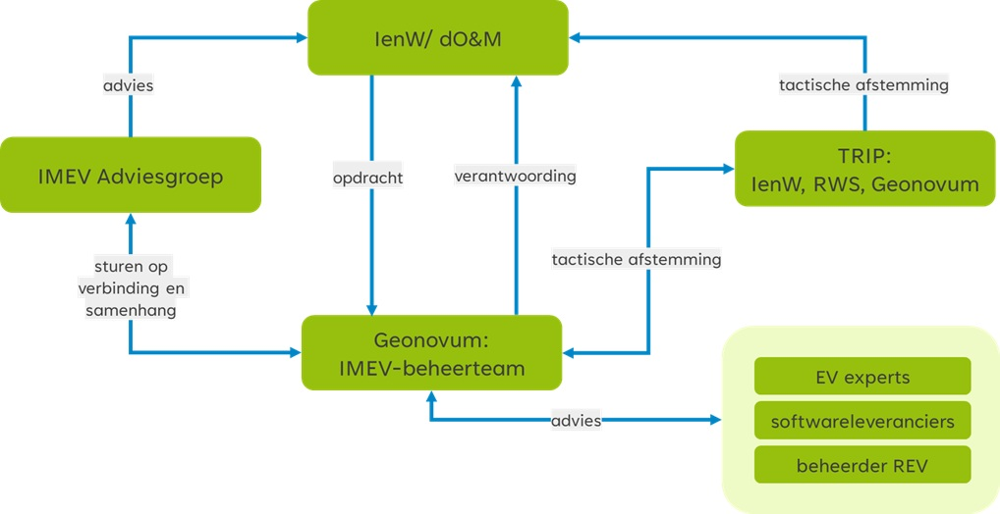

# Strategie {#491B6E78}
<b>Governance, visie en financiën zijn de strategische activiteiten voor het beheer van standaarden.</b>
## Governance {#3F808C16}
In opdracht van het Ministerie van Infrastructuur en Waterstaat beheert Geonovum het Informatiemodel Externe Veiligheid. Inhoudelijke en financiële verantwoording legt Geonovum af via kwartaalrapportages. Jaarlijks leggen wij de feedback van de opdrachtgever over ons werk vast door middel van een evaluatie. Door middel van een meerjarige opdracht is de inzet van mensen voor het beheer van het IMEV voor de lange termijn geborgd. 
Rijkswaterstaat is in opdracht van het ministerie van IenW de beheerder van het Register Externe Veiligheidsrisico’s. Rijkswaterstaat is daardoor de senior user van het informatiemodel. In <a href='#d4e974'>Figuur 2</a> is de organisatiestructuur weergegeven voor het beheer van het IMEV. In <a href='#tGBMVS'>Tabel 2</a> is de governance van de IMEV beheeropdracht samengevat. 
 
<table id="tGBMVS" style='width: 100%;'><caption>Tabel 2 - Governance beheeropdracht IMEV</caption> 
<colgroup><col id='col1' style='width: 39.34312478316179%;'>
<col id='col2' style='width: 60.656875216838216%;'>
</colgroup>
<thead><tbody><tr><th class='left'>
<b>Organisatie</b>
</th>
<th class='left'>
<b>Rol</b>
</th>
</tr></thead>
<tbody><tr><td class='left'>
Ministerie van Infrastructuur en Waterstaat, Directoraat-generaal Milieu en Internationaal
</td>
<td class='left'>
Opdrachtgever – Rianne Dobbelsteen
</td>
</tr>
<tr><td class='left'>
Geonovum
</td>
<td class='left'>
Opdrachtnemer – Monique van Scherpenzeel 
</td>
</tr>
<tr><td class='left'>
Rijkswaterstaat (WVL)
</td>
<td class='left'>
Beheerder van het register externe veiligheidsrisico’s als senior user IMEV – Bob Felix
</td>
</tr>
</tbody>
</table>
 
<figure id="d4e974"></img>
<figcaption>Organisatiestructuur IMEV op basis van <a href='https://logius-standaarden.github.io/BOMOS-Verdieping/' target='_blank'>BOMOS</a></figcaption></figure>

Er zijn twee gremia die niet onderdeel zijn van de governance maar op tactische niveau wel bijdragen aan de uitvoering van de IMEV beheeropdracht: de IMEV Adviesgroep en het Tripartite overleg (TRIP). 
De bronhouders worden via de koepels IPO, VNG en ODNL vertegenwoordigd in de IMEV Adviesgroep. Ook het  ministerie van IenW als opdrachtgever, Rijkswaterstaat als beheerder van het REV en Geonovum als beheerder van het IMEV nemen deel aan deze adviesgroep. De adviesgroep heeft een onafhankelijk voorzitter. Het doel is het controleren van het tot zover doorlopen wijzigingsproces, het wijzigingsvoorstel van advies te voorzien en dit advies aan de opdrachtgever voor te leggen. De opdrachtgever besluit of de wijzigingen worden doorgevoerd op het IMEV. 
In het TRIP stemmen het ministerie van IenW, Geonovum en Rijkswaterstaat op basis van beleid en visie de roadmap en planning van het beheer en de doorontwikkeling van het IMEV en REV af. 

## Visie {#70DDEAA4}
Geonovum ontwikkelt en beheert nationale en sectorale standaarden op het gebied van geo-informatie. De standaarden die Geonovum in beheer heeft, zijn ingebed in nationale en internationale standaarden. Geonovum voert beheertaken transparant uit en in samenwerking met belanghebbende partijen. Alle activiteiten in het beheer en (door)ontwikkeling zijn gericht op het structureel werken aan, beschikbaar stellen en houden van een (set van) standaard(en) die steeds past bij de actuele behoefte van de belanghebbenden.
 
 
Beheer van een standaard betekent altijd beheer <i>én</i> ontwikkeling van die standaard. Het beheer van standaarden heeft betrekking op het beschikbaar houden en aanpassen van bestaande standaarden op basis van nieuwe wensen en eisen zonder dat er sprake is van functionele uitbreidingen. Denk aan het voor iedereen toegankelijk maken van een standaard op een website, het bieden van implementatie ondersteuning, het verzamelen van wensen en eisen en naar behoefte uitbrengen van nieuwe versies.
Het ontwikkelen van standaarden heeft betrekking op de ontwikkeling van oplossingen voor nieuwe functionaliteiten. Dit kan betekenen dat op basis van de ontwikkeling de bestaande standaard wordt uitgebreid, bijvoorbeeld op grond van wet- en regelgeving worden nieuwe milieubelastende activiteiten aan het IMEV toegevoegd, of dat er een nieuwe standaard ontstaat, bijvoorbeeld afspraken rondom visualisering op uitwisseling. 
 
 
De grondslag voor het beheer en de (door)ontwikkeling van het IMEV:  
<ul><li>Omgevingswet inwerkingtreden 1 januari 2024;</li>
<li>Besluit kwaliteit leefomgeving;</li>
<li>Besluit activiteiten leefomgeving;</li>
<li>Omgevingsbesluit;</li>
<li>Omgevingsregeling (artikel 12.2).</li>
</ul>
 

De documentatie met uitgangspunten (visie, doelarchitectuur) van het Digitaal Stelsel Omgevingswet (DSO) vormen de randvoorwaarden voor het REV. In het DSO is ervoor gekozen gegevens te ontsluiten vanuit de bron. Het REV is een van de eerste vier <a href='https://iplo.nl/digitaal-stelsel/stelselcatalogus-omgevingswet/informatieproducten/' target='_blank'>informatieproducten</a> die worden gekoppeld aan het DSO. De gegevens over externe veiligheidsrisico’s zijn daardoor ook via het Omgevingsloket van het DSO te gebruiken. Het in 2024 gestarte programma Digitaal Stelsel VTH is voor Geonovum en Rijkswaterstaat een belangrijke ketenpartner voor het VTH-proces bij de bronhouders.

## Financiën  {#7BCF1AAB}
Sinds 2021 beheert Geonovum het Informatiemodel Externe Veiligheid. Wij doen dat in opdracht van het ministerie van Infrastructuur en Waterstaat. In het kader van een meerjarige opdracht volgt de financiering uit een jaarlijks offerteverzoek van IenW, offerte van Geonovum en vaststelling bijdrage door IenW. Jaarlijkse wordt het benodigd budget tussen opdrachtgever en opdrachtnemer afgestemd. 
Eens per kwartaal rapporteert Geonovum aan het ministerie van IenW over de voortgang van het beheer van de standaard. Naast rapportage over activiteiten en resultaten, leggen wij met de kwartaalrapportage ook verantwoording af aan de opdrachtgever over de besteding van het toegekende budget. 
