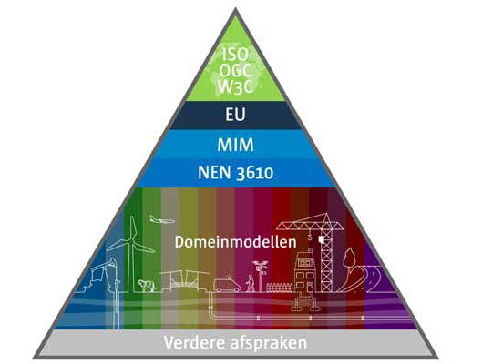

# Tactiek {#5AE88FF8}
<b>Community, architectuur, rechtenbeleid, adoptie en erkenning, kwaliteitsbeleid en benchmarking zijn de tactische activiteiten voor het beheer van de standaarden.</b>
## Community {#2C5ABC1A}
Stichting Geonovum heeft een onafhankelijke positie als beheerder van geo-standaarden. Het ontwikkelen en beheren van standaarden doen wij open en transparant. Betrokkenheid van de gemeenschap bij de verdere doorontwikkeling van de standaarden is voor het gebruik en het draagvlak ervan van groot belang. De standaarden gelden voor en worden gebruikt door publieke en private organisaties en bijvoorbeeld kennisinstellingen. Zij vormen samen de community. Alle (overheids)stakeholders, en commerciële stakeholders, hebben inspraak in het beheer en (door)ontwikkeling van het IMEV in vorm van bijvoorbeeld leveranciers- en bronhoudersoverleggen maar zij zijn niet beslissingsbevoegd (zie <a href='#d4e974'>Figuur 2</a>). Aan deze inspraak zijn geen kosten verbonden.
 
 
Er zijn verschillende gremia die het EV netwerk bijeenbrengen. De gremia zijn met name op operationeel niveau ingericht en hebben tot doel het gebruik van het REV, de kennis en ervaring met het REV en actualiteiten te delen. Het IMEV-beheerteam neemt deel aan het door Rijkswaterstaat georganiseerde bronhoudersoverleg, het Operationeel Overleg Gebruikers (OOG - gebruikers van de REV data) en het Operationeel Overleg Registrerende gebruikers (OOR - leveranciers van de REV data). Het IMEV-beheerteam levert ook een tactisch en operationele bijdrage aan bij het REV beheerteam voor het verbeteren van de datakwaliteit van het REV. Geonovum organiseert het softwareleveranciers overleg gericht op de technische implementatie IMEV. Doelgroep voor deze bijeenkomst zijn softwareleveranciers, buisleidingbeheerders, omgevingsdiensten en veiligheidsdiensten die software ontwikkelen voor het aanleveren en muteren van data in het Register Externe Veiligheidsrisico's.
 
 
Geonovum informeert en betrekt de community via haar website en via nieuwsbrieven van de beheerder van REV en Geonovum zelf. Vanuit de community worden (al dan niet ad hoc) werkgroepen gevormd voor het klankborden over ontvangen wijzigingsverzoeken en het ontwikkelen van oplossingen op het moment dat dit nodig is. De vergaderdata van deze werkgroepen worden gepubliceerd op de <a href='https://www.geonovum.nl/agenda' target='_blank'>Geonovum website</a> en de <a href='https://www.registerexterneveiligheid.nl/agenda' target='_blank'>REV website</a>. Inschrijven voor bijeenkomsten over het IMEV is mogelijk via imev@geonovum.nl.

## Architectuur {#30830BA9}
Onze standaarden en informatiemodellen ontwikkelen wij niet in splendid isolation; ze moeten opgehangen zijn aan en/of binnen nationale en internationale standaarden. Door onze producten op te hangen aan, of in te passen in nationale en internationale standaarden, architecturen en infrastructuren, wordt de uitwisseling van gegevens gemakkelijker en hoeft niet iedere keer het wiel opnieuw te worden uitgevonden. 
 
 
Het IMEV wordt permanent afgestemd met de volgende standaarden: 
<ul><li>Metamodel voor informatiemodellering – MIM;</li>
<li>Standaard voor beschrijven van begrippen - NL-SBB;</li>
<li>INSPIRE en Europese richtlijnen (waaronder Seveso);</li>
<li>Basismodel voor geo-informatie - NEN3610 (zie <a href='#d4e1428'>Figuur 3</a>);</li>
<li>Internationale OGC API standaarden;</li>
<li>API standaarden op de lijst open standaarden van het Forum Standaardisatie;</li>
<li>Informatiemodel Omgevingswet – IMOW;</li>
<li>Informatiemodel Geluid.</li>
</ul>
 
 
De internationale API standaarden zijn volop in ontwikkeling en zullen effect hebben op de IMEV API specificaties. Ook de ontwikkeling van de standaarden voor het Digitaal Stelsel VTH, waaronder het CIM VTH Flo, zullen op termijn invloed kunnen hebben op de doorontwikkeling van het IMEV. 
<figure id="d4e1428"></img>
<figcaption>IMEV als domeinmodel onder het nationale NEN3610 Basismodel voor geo-informatie</figcaption></figure>

## Rechtenbeleid {#3F9222D8}
Het onderwerp rechtenbeleid uit BOMOS vertaalt zich naar gebruiksvoorwaarden van de producten van de standaarden. Niet alleen voor de documentatie maar ook voor de technische bestanden. 
 
 
Geonovum hanteert <a href='https://creativecommons.nl/' target='_blank'>Creative Commons</a> om voor de producten van de standaarden aan te geven voor wie en op welke wijze de standaarden beschikbaar zijn:
<i>Elk nieuw document dat vanaf 1 januari 2018 door Geonovum  wordt  gepubliceerd, is voorzien van  de volgende licentie: </i><a href='https://creativecommons.org/licenses/by-nd/4.0/deed.nl' target='_blank'><i>https://creativecommons.org/licenses/by-nd/4.0/deed.nl</i></a> (kort: CC BY-ND 4.0). In het geval (delen van) standaarden zijn opgenomen in wet- en regelgeving (zoals het geval is bij het IMEV) zijn de gebruiksvoorwaarden van Geonovum niet van toepassing omdat de Nederlandse wetgeving boven creative commons geldt. De grondslag voor het gebruik van het informatiemodel externe veiligheid is opgenomen in artikel 12.2 van de <a href='https://wetten.overheid.nl/BWBR0045528' target='_blank'>Omgevingsregeling</a> van de Omgevingswet. 
 
 
Geonovum zorgt ervoor dat de documentatie van onze standaarden toegankelijk is conform de WCAG richtlijnen. Hiervoor gebruiken wij html-formaat conform ReSpec. De Nederlandse set van ReSpec afspraken wordt door Logius beheerd. 

## Adoptie en erkenning {#7C0F229A}
Het gebruik van de standaarden is niet vanzelfsprekend. Voor de adoptie en erkenning van het IMEV is het van belang dat de standaarden goed aansluiten bij de werkpraktijk. De samenwerking met gebruikers- en expertgroepen van het IMEV en het REV is daarom cruciaal. Om signalen vanuit de dagelijkse praktijk vroeg op te kunnen vangen, neemt Geonovum ook deel aan bij de bronhoudersoverleggen. Via de REV-nieuwsbrief houden wij het netwerk op de hoogte van ontwikkelingen en kunnen we antwoorden op veel gestelde vragen proactief delen. 

## Kwaliteitsbeleid en benchmarking {#44553739}
Kwaliteit is de basis voor een bruikbare standaard. Het gebruik, de bruikbaarheid en de gebruikers staan centraal. De standaard is een middel in het werkproces van overheden die hen beter moet laten presteren. Periodiek overleg met de IMEV Adviesgroep, overleggen met softwareleveranciers, opdrachtgever, bevoegde gezagen c.q. bronhouders, andere gebruikers van de standaard, belanghebbenden en contacten via de helpdesk zijn instrumenten die ons helpen de kwaliteit van het IMEV te bewaken. De technische kwaliteit van de toepassing van de standaard is te toetsen met behulp van validatieregels. Voor het wijzigen van de standaard hanteren we een vaste werkwijze dat is vastgelegd in het <a href='https://docs.geostandaarden.nl/imev/IMEV-wijzigingsprotocol/' target='_blank'>Wijzigingsprotocol Informatiemodel Externe Veiligheid</a>. 
 
 
<a href='#34787AAB'>BOMOS</a> en de <a href='https://www.go-fair.org/fair-principles/' target='_blank'>FAIR Principes</a> zijn de basis voor het standaardisatiewerk van Geonovum. Op eenduidige manieren samenwerken om informatie zo beter te kunnen beveiligen, makkelijker uit te wisselen en toegankelijker te maken voor iedereen. Dat is hoe open standaarden de samenwerking bevorderen tussen de overheid, burger en het bedrijfsleven. De FAIR Principes zijn een hulpmiddel daarin: het doel van de principes is het hergebruik van waardevolle data mogelijk maken. De FAIR Principes dwingen geen standaarden af, maar moedigen communities aan om data en diensten vindbaar, toegankelijk, interoperabel en herbruikbaar te maken.
Geonovum maakt standaarden, informatiemodellen en andere afspraken die <u>geodata</u> FAIR maken: De verbindende kracht van standaardisatie in vindbare, toegankelijke, uitwisselbare en herbruikbare geo-informatie: 
<ul><li><b>Findable</b><b> (vindbaar)</b> De eerste stap bij het (her)gebruiken van data is om de data te vinden. Metadata en data moeten gemakkelijk te vinden zijn voor zowel mensen als computers. Machineleesbare metadata is essentieel voor het ontdekken van datasets en services.</li>
<li><b>Accessible</b><b> (toegankelijkheid)</b> Zodra de gebruiker de benodigde gegevens heeft gevonden, moet hij/zij weten hoe deze kunnen worden geraadpleegd, inclusief authenticatie en autorisatie.</li>
<li><b>Interoperable</b><b> (</b><b>interoperabel</b><b>)</b> De gegevens moeten meestal worden geïntegreerd met andere gegevens. Bovendien moeten de gegevens samenwerken met applicaties of workflows voor analyse, opslag en verwerking.</li>
<li><b>Reusable</b><b> (herbruikbaar)</b> Het uiteindelijke doel van FAIR is het hergebruik van data te optimaliseren. Om dit te bereiken moeten metadata en data goed worden beschreven, zodat ze in verschillende situaties kunnen worden gerepliceerd en/of gecombineerd.</li>
</ul>
 
 
Bij het beheer van het REV is datakwaliteit een belangrijk speerpunt. Het IMEV is de basis voor de bestaande datastructuur in het REV. Het IMEV-beheerteam is betrokken, wordt geconsulteerd en geeft advies over de (on)mogelijkheden van het gebruik van IMEV voor datakwaliteit. Hogere eisen aan datakwaliteit kunnen aanleiding zijn voor doorontwikkeling van het IMEV. Het inzetten van een REV validator (zie paragraaf <a href='#6D48D65F'>validatie en certificatie</a>) kan ervoor zorgen dat gebruikers van standaarden de correctheid van de implementaties kunnen testen.
 
 
Kwaliteit van de IMEV producten en van onze andere standaarden wordt getoetst in de interne Geonovum architectuurraad. De <a href='https://gitdocumentatie.logius.nl/publicatie/bomos/verdieping/' target='_blank'>kwaliteitsinstrumenten van BOMOS</a> geven hiervoor richting. Het beheer van de standaard is toegelicht op de Geonovum website, <a href='https://www.geonovum.nl/geo-standaarden/informatiemodel-externe-veiligheid' target='_blank'>pagina IMEV</a>, waar ook dit beheerplan en het <a href='https://docs.geostandaarden.nl/imev/IMEV-wijzigingsprotocol/' target='_blank'>wijzigingsprotocol</a> beschikbaar en raadpleegbaar zijn. Jaarlijks toetsen wij het beheer en kijken vooruit met behulp van de <a href='https://logius.nl/domeinen/infrastructuur/bomos/self-assessment' target='_blank'>BOMOS self-assessment</a> om het beheer van het IMEV doelgericht te optimaliseren. De resultaten van de self-assessment bespreken wij met de opdrachtgever.  
 
 
Het IMEV is een bij de Omgevingswet- en regelgeving voorgeschreven standaard. Geonovum voert geen activiteiten uit ten behoeve van benchmarking. 
