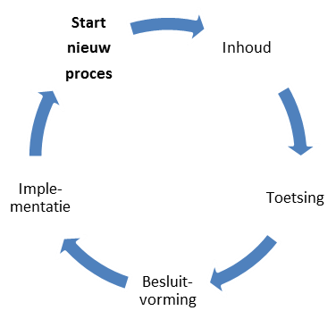

# Operationeel {#083B8D00}
<b>Initiatie, wensen en eisen, ontwikkeling, uitvoering, documentatie en hulpmiddelen zijn onderdeel van de operationele activiteiten voor het beheer van de standaarden.</b>
## Initiatie {#741CFF7D}
Identificatie van nieuwe ideeën voor bijvoorbeeld een nieuwe specificatie, werkafspraak, documentatie of voorbeelden is een taak van het beheerteam. De signaalfunctie van het beheerteam is hier belangrijk. Deze signaalfunctie kan alleen werken door het voeren van de IMEV helpdesk, samenwerking en goed contact met de opdrachtgever, softwareleveranciers, REV beheerders en andere gebruikers van de standaard. Na identificatie van een vraagstuk kan dit leiden tot nieuwe implementatieondersteuning of wijzigingsverzoeken voor de doorontwikkeling van het IMEV. Voorbeelden van initiatie voor het IMEV zijn: 
<ul><li>Nieuwe milieubelastende activiteiten in de Omgevingswet- en regelgeving (met name het Bkl);</li>
<li>Doorontwikkeling en beheer van testbestanden en voorbeeldbestanden in samenwerking met Rijkswaterstaat;</li>
<li>Doorontwikkeling van de OGC API standaarden en de invloed op het IMEV, de API specificaties van het IMEV en de REV-API;</li>
<li>De datakoppeling met het knooppunt van het DSO en de Atlas Leefomgeving.</li>
</ul>
 
Het beheerteam beheert de lijst van wensen en eisen voor het IMEV in de publieke IMEV werkomgeving op <a href='https://github.com/Geonovum/imev-werkomgeving/issues' target='_blank'>GitHub</a> en initieert in overleg met de opdrachtgever een wijzigingsproces van de standaard. Het wijzigingsproces volgt de afspraken zoals deze zijn vastgelegd in het <a href='https://docs.geostandaarden.nl/imev/IMEV-wijzigingsprotocol/' target='_blank'>wijzigingsprotocol</a>. 
In het wijzigingsprotocol staan de sturende principes achter het wijzigingsproces voor het IMEV: de manier waarop wijzigingen in de betreffende standaard plaatsvinden. Met het protocol wordt elke wijziging van de standaard een voorspelbaar proces voor de ketenpartners. De IMEV Adviesgroep heeft een belangrijke rol in het wijzigingsproces: zij stuurt op verbinding en samenhang, controleert het wijzigingsproces en voorziet het wijzigingsvoorstel van advies voor het al dan niet doorvoeren van de wijzigingen en opleveren van een nieuwe versie van IMEV. De opdrachtgever besluit of de wijzigingen worden doorgevoerd op het IMEV.
In het protocol zijn basisbegrippen en uitgangspunten uiteengezet voor het wijzigingsproces, bijvoorbeeld wat onder nieuwe en volgende versies verstaan wordt, en wanneer deze nieuwe versie(s) verwacht mogen worden. De daadwerkelijke planning van een nieuwe versie is op hoofdlijnen uitgewerkt in de jaarplanning van de standaard. De jaarplanning is een uitwerking van de (nog te ontwikkelen) roadmap van de betreffende standaard waarin voor de komende jaren de verdere ontwikkeling en de uitfasering en implementatieondersteuning van de (verschillende versies van de) standaard is opgenomen. Met behulp van een wijzigingsprotocol voor de standaard geeft Geonovum:
<ul><li>inzicht in het behandel- en besluitproces dat ten grondslag ligt aan het versiebeheer;</li>
<li>inzicht in de aangeboden wijzigingsvoorstellen;</li>
<li>stabiliteit aan de standaard;</li>
<li>continuïteit aan de standaard;</li>
<li>een eenduidige aanpak.</li>
</ul>
 
Het IMEV-beheerteam initieert in overleg met de opdrachtgever en ketenpartners een wijzigingsproces van de standaard.

## Wensen en eisen {#598C31A3}
Belanghebbenden, gebruikers van de standaard, kunnen wijzigingsverzoeken variërend van wensen tot aanpassing van en fouten in de standaard, per mail aan de <a href='mailto:imev@geonovum.nl' target='_blank'>IMEV helpdesk</a> indienen bij Geonovum. Het IMEV-beheerteam onderzoekt of de melding inderdaad een wijzigingsverzoek is of een vraag over de standaard. Wanneer de vraag een wijzigingsverzoek blijkt te zijn plaatsen wij deze op de lijst van wijzigingsverzoeken op onze publieke IMEV werkomgeving op <a href='https://github.com/Geonovum/imev-werkomgeving/issues' target='_blank'>GitHub</a>. Per wijzigingsverzoek leggen we vast:
<ul><li>aanleiding van het wijzigingsverzoek;</li>
<li>voorgestelde wijziging;</li>
<li>impactanalyse;</li>
<li>prioriteit;</li>
<li>toelichting.</li>
</ul>
De issues worden van labels voorzien die ook in het wijzigingsvoorstel terugkomen, bijvoorbeeld nieuwe MBA, bug of conformiteit. Zo is te volgen of een melding onderzocht wordt, of bijvoorbeeld op korte termijn meegenomen in een wijzigingsvoorstel. Het doel is transparantie in het beheer en de doorontwikkeling van de standaard. 
 
 
<figure></img>
<figcaption></figcaption></figure>
 
## Ontwikkeling {#6DADA5C8}
Sinds ingebruikname van het REV op 1 januari 2023 en het inwerkingtreden van de Omgevingswet is het IMEV in gebruik voor het aanleveren van dat aan het REV. Het IMEV bevindt zich in de fase ‘volwaardige toepassing’ (zie <a href='#d4e2263'>Figuur 5</a>). 
 
 
<figure></img>
<figcaption>Levensfases van een standaard volgens <a href='https://gitdocumentatie.logius.nl/publicatie/bomos/fundament/' target='_blank'>BOMOS</a></figcaption></figure>

 
 
Afspraken over de doorontwikkeling van het informatiemodel zijn vastgelegd in het <a href='https://docs.geostandaarden.nl/imev/IMEV-wijzigingsprotocol/' target='_blank'>IMEV wijzigingsprotocol</a>. Tijdens het wijzigingsproces worden de fasen Inhoud, Toetsing, Besluitvorming en Implementatie doorlopen (zie <a href='#d4e2366'>Figuur 6</a>). De type wijzing, van foutherstel tot het toevoegen van nieuwe milieubelastende activiteiten, heeft invloed op de zwaarte van het wijzigingsproces. Het releasebeleid, waaronder versiebeheer en consultaties, is ook vastgelegd in het wijzigingsprotocol. De hulpmiddelen die het IMEV-beheerteam inzet, zijn benoemd in paragraaf <a href='#32D5C642'>uitvoering</a>. 
 
 
<figure></img>
<figcaption>Fasen wijzigingsproces</figcaption></figure>

## Uitvoering {#32D5C642}
Voor de uitvoering van het beheer van het informatiemodel externe veiligheid, zet Geonovum adviseurs geo-standaarden, een informatiemodelleur en communicatieadviseurs in. Onderling verdelen zij de werkzaamheden. De leidraad daarbij is: 
<ul><li>Het Informatiemodel is voor de mens- en machineleesbaar, testbaar, implementeerbaar, is duidelijk, kent geen inhoudelijk fouten en is betrouwbaar;</li>
<li>Toetsing doen wij samen met gebruikers- en expertgroepen.</li>
</ul>
 
Wij gebruiken hierbij de volgende hulpmiddelen en tooling. 
De <a href='https://www.geonovum.nl/' target='_blank'>Geonovum website</a> is de centrale toegang om in contact te komen met Geonovum en informatie in te winnen over ons werk: Geonovum verbindt, verkent en verankert. Dit betekent dat nieuwe opdrachten, nieuwe werkzaamheden, nieuwe thema’s via de Geonovum website worden ontsloten en alleen bij hoge uitzondering en een degelijke onderbouwing er een nieuwe separate website wordt ontwikkeld. 
 
 
De publieke werk- en ontwikkelomgeving van de standaarden en de producten van de standaarden is de <a href='https://github.com/Geonovum' target='_blank'>Geonovum GitHub</a>. Geonovum gebruikt voor de standaarden en de producten van de standaarden die wij ontwikkelen en beheren zogenoemde publicatieservers. Deze publicatieservers gelden als bronlocatie voor de producten van onze standaarden en zijn vindbaar. De publicatieservers zijn: 
<ul><li><a href='http://register.geostandaarden.nl/' target='_blank'>Technisch register</a>: Publiceren van technische bestanden, behorend bij standaarden ten behoeve van implementatieondersteuning. Het technisch register is de centrale vindplaats voor de informatiemodellen uit het NEN3610 stelsel, plus de technische standaarden die bij die informatiemodellen horen zoals het IMEV.</li>
<li><a href='https://definities.geostandaarden.nl/' target='_blank'>Conceptenbibliotheek</a>: Publiceren van semantische begrippen uit informatiemodellen. In de conceptenbibliotheek zijn de definities van concepten die gebruikt worden in NEN 3610 informatiemodellen opgenomen, waarmee wij harmonisatie en integratie bevorderen. De concepten/ objecten zijn beschreven in het informatiemodel externe veiligheid. Ten behoeve van de conceptenbibliotheek hebben we een <a href='https://staging-definities.geostandaarden.nl' target='_blank'>testomgeving van de conceptenbibliotheek</a>.</li>
<li><a href='https://docs.geostandaarden.nl/' target='_blank'>Documenten register</a>: Publiceren van formele versies (consultatieversie, versie ter vaststelling, vastgestelde versie) van standaarden en eindversies van publieke documentatie. Door eenduidige, eenmalige bronlocatie van de (technische) documentatie van de standaarden die wij ontwikkelen en beheren in ReSpec (HTML) formaat, zijn de standaarden goed vindbaar op een persistente URI, voor zowel actieve als archiefversies. Met deze werkwijze voorkomen we het werken met oude kopieën (gebruik “standaarden bij de bron”). Daarnaast is de levensloop van standaarden volledig transparant. </li>
<li><a href='https://modellen.geostandaarden.nl/' target='_blank'>Ontologieën register</a>: Publiceren van ontologieën die zijn afgeleid van informatiemodellen die Geonovum beheert, vooralsnog doen we dit alleen voor NEN 3610.</li>
</ul>
 
 
De volgende tooling zetten wij voor de ontwikkeling en het beheer van de producten van onze standaarden. 
<ul><li><b>Enterprise architect</b>: applicatie voor ontwikkeling van informatiemodellen (UML modellering);</li>
<li><b>GitHub</b>: publieke werkomgeving voor zowel niet-formele versies (werkversies) van documenten als technische onderdelen van de standaarden: beheer van de producten van de standaarden. Doel: transparante ontwikkeling van onze producten en gericht op de inhoud; </li>
<li><b>Imvertor: </b>MIM-conformiteit toetsen van informatiemodellen, het genereren documentatie en technische bestanden;</li>
<li><b>Jira</b>: Het IMEV-beheerteam hanteert voor de tijd en planning een kanban bord in Jira waar ook de IMEV helpdesk is ingericht. We hanteren BOMOS als leidraad voor de type werkzaamheden.</li>
<li><b>Oxygen</b>: het editen, vergelijken en valideren van XML en JSON bestanden;</li>
<li><b>ReSpec</b>: automatische opmaak, referentie- en versiebeheer voor publiceren op het web van standaarden en andere gerelateerde documenten (in HTML formaat) op docs.geostandaarden.nl;</li>
<li><b>Subversion</b>: technische beheeromgeving en versiebeheer van de UML modellen op svn.geostandaarden.nl;</li>
<li><b>Visual Studio Code: </b>Editor voor de markdown bestanden. Er blijkt dat verschillend parallel gebruik van verschillende editors kunnen leiden tot verschillen in uitkomst in ReSpec. ReSpec vereist GitHub Flavoured Markdown.</li>
</ul>
 

## Documentatie {#79A4FC48}
De volgende type documentatie worden door Geonovum gebruikt bij de ontwikkeling en het beheer van standaarden. 
<ul><li><b>Norm: </b>een norm is bij een officieel standaardisatie instituut ondergebracht en bevat bindende afspraken. Naast het gebruik van normen is NEN 3610 de enige norm waar Geonovum een inhoudelijke verantwoordelijkheid heeft. Het formele beheer en beslissingen worden genomen in de NEN normcommissie 351 240 waar Geonovum de voorzitter van is. NEN is een normalisatie instituut. NEN is net als Geonovum een stichting en kan daarmee geen juridische status toekennen aan normen. Het  verwijst vooral naar de status die de NEN heeft vanuit de overheid en in het werken vanuit lidstaten.  </li>
<li><b>Standaard:</b> een document met (bindende) afspraken. Overkoepelende term voor de verschillende types standaarden. Normen zijn in principe niet meer bindend dan standaarden. </li>
<li><b>Informatiemodel:</b> een standaard waarbij door de term informatiemodel te hanteren wordt aangegeven dat het een abstractie (het model) vormt van de werkelijkheid zoals beschreven binnen een bepaalde sector/domein. Informatiemodellen zijn een semantische invulling van normen voor sectoren zoals ruimtelijke ordening, kabels en leidingen, water, etc..</li>
<li><b>Praktijkrichtlijn: </b>praktijkrichtlijnen zijn producten die informatie geven, vaak met een technisch karakter, die nodig is voor het toepassen van standaarden. Een praktijkrichtlijn hoort altijd bij een standaard/norm.</li>
<li><b>Handreiking:</b> op zichzelf staande documentatie dat als doel heeft een hulpmiddel te zijn, niet verplichtend maar ondersteunend.</li>
<li><b>Werkafspraak: </b>legt uit hoe wetgeving moet worden toegepast bij onduidelijkheden, discrepanties of fouten in de standaarden.</li>
<li><b>Algemeen: </b>op zichzelf staande algemene documentatie over standaarden. De documentatie betreft niet een specifieke standaard of onderdeel daarvan, het is ook geen beheerdocumentatie van een specifieke standaard.</li>
<li><b>Beheerdocumentatie: </b>documentatie met betrekking tot het beheerproces van de standaard. Deze documentatie betreft niet een standaard of onderdeel daarvan, zoals een handreiking of werkafspraak. Dit kan interne gerichte documentatie zijn voor vastleggen van stappen in het dagelijkse werkproces, planning of hoe de helpdesk werkt. Ook kan dit een beheerplan of handboek zijn. Als dit soort documentatie publiekelijk beschikbaar wordt gesteld, dan gebeurt dit door middel van ReSpec. </li>
</ul>
